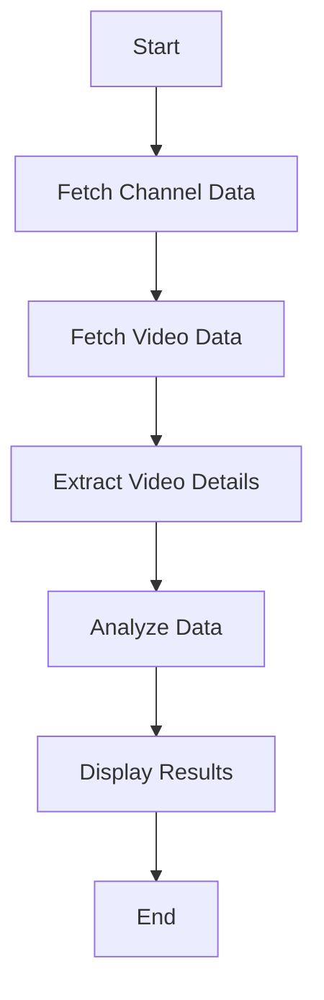

# YouTube Web Scraping Project


## Project Overview

The **YouTube Web Scraping** project is a Python-based tool designed to analyze and extract data from Kenyan YouTube channels. It leverages the YouTube Data API to fetch channel and video information and performs data analysis to provide insights into channel performance and video content.

## Features

- 📊 **Fetch Channel Data:** Retrieve detailed information about YouTube channels.
- 🎥 **Fetch Video Data:** Collect data on recent videos from the specified channel.
- 🔍 **Data Extraction:** Extract key details from the video data for analysis.
- 📈 **Data Analysis:** Analyze and present the data collected to gain insights.

## Prerequisites

- Python 3.x
- Jupyter Notebook
- Required Python libraries (`requests`, `pandas`, etc.)

## Installation

1. **Clone the Repository:**
   ```bash
   git clone https://github.com/Blackie360/youtube-webscrapping-
   ```

2. **Navigate to the Project Directory:**
   ```bash
   cd youtube-webscrapping-
   ```

3. **Install Dependencies:**
   Create a `requirements.txt` file and include the necessary packages:
   ```bash
   pip freeze > requirements.txt
   ```
   Then install the dependencies:
   ```bash
   pip install -r requirements.txt
   ```

4. **Obtain YouTube Data API Key:**
   - Go to the [Google Developers Console](https://console.developers.google.com/)
   - Create a new project or select an existing one
   - Enable the YouTube Data API v3
   - Create credentials (API key)
   - Update the script with your YouTube Data API key

## Usage

1. **Set Up Your API Key:**
   In the `youtubeScrapping.ipynb` notebook, replace `YOUR_API_KEY` with your actual YouTube Data API key.

2. **Run the Notebook:**
   Open the `youtubeScrapping.ipynb` notebook in Jupyter and execute the cells sequentially.

3. **Review Results:**
   The analysis results, including channel and video details, will be displayed in the notebook.

## Workflow




## Use Cases

This project is useful for:

- 🎬 **Content Creators:** Analyze performance of their own or competitors' channels.
- 📊 **Marketing Analysts:** Understand audience engagement and content trends.
- 🔬 **Researchers:** Gather data for studies on digital content and social media impact.

## Future Enhancements

- 📊 **Extended Analysis:** Include more metrics (views, likes, comments, engagement rates).
- 📈 **Data Visualization:** Integrate libraries for graphs and charts.
- 📅 **Automated Reports:** Generate periodic reports with insights and trends.
- 🔍 **Advanced Filtering:** Implement filters for specific data analysis.

## Contributing

Contributions are welcome! Please feel free to submit a Pull Request.

## License

This project is licensed under the MIT License - see the [LICENSE](LICENSE) file for details.

---

<p align="center">
  Made with ❤️ by <a href="https://github.com/Blackie360">Blackie360</a>
</p>
